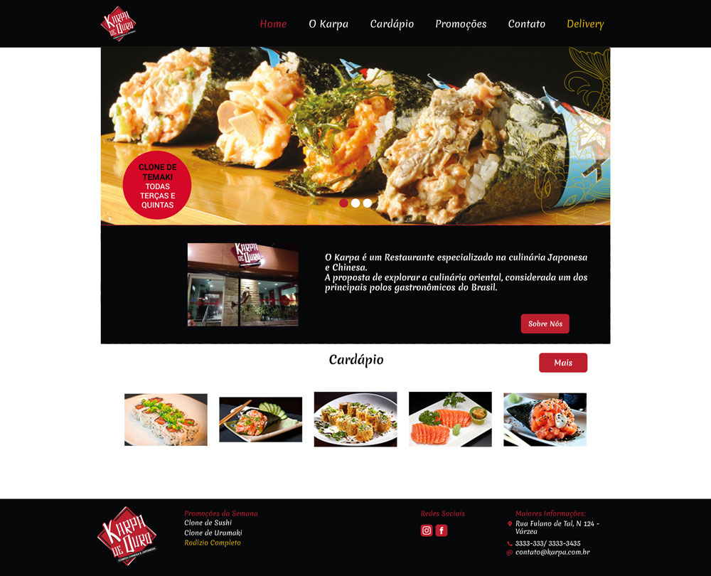

# Portfolio-Website-Restaurante-Japones
Website desenvolvido como projeto acadêmico, linguagem de programação usadas foi HTML5 e CSS3. Projeto com o intuito de mostrar meu conhecimento prévio na área como Front-end.

Acesso ao website pelo link https://larim0ura.github.io/Portfolio-Website-Restaurante-Japones/.

